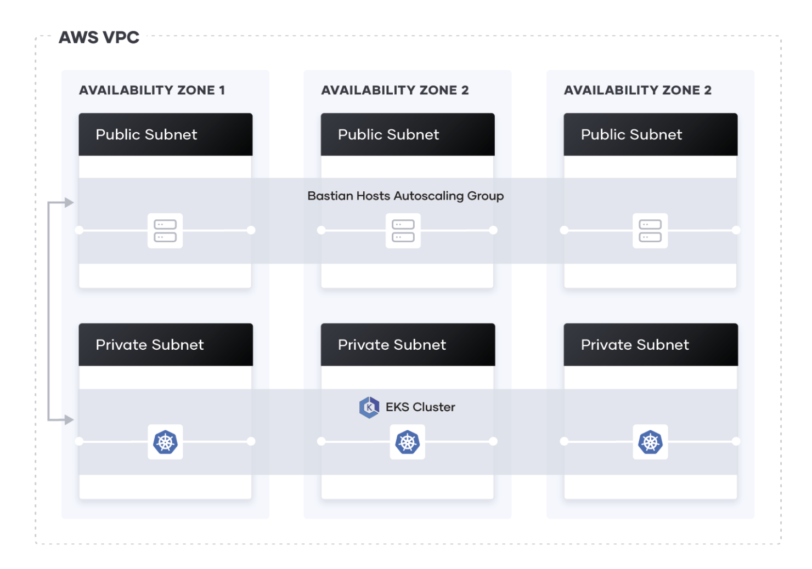

# terraform-aws-eks-airflow

The general overview of the cluster is this:



The current architecture was implemented following this guide [Provisioning an EKS Cluster guide](https://learn.hashicorp.com/terraform/kubernetes/provision-eks-cluster)

### Prerequisites

AWS account configured. For this example we are using default profile and us-east-2 region

#### Dependencies
- Cluster version: 1.15 (Specified in terraform.tfvars, version 1.16 seems not to be working when using Helm)
- Terraform >= 0.12

### Installing

To have K8s cluster running:

Execute Terraform commands:

```
terraform init
```
```
terraform apply
```
Once that the cluster is created, set the kubectl context:

```
aws eks --region <your-region> update-kubeconfig --name <your-cluster-name>
```

Create a namespace for airflow deployment
```
kubectl create namespace airflow
```

Follow the instruction according to the Helm version that you want to use

### Helm2

Initialize the tiller:
```
helm init
```

Configure the tiller:

```
kubectl create serviceaccount --namespace kube-system tiller
kubectl create clusterrolebinding tiller-cluster-rule --clusterrole=cluster-admin --serviceaccount=kube-system:tiller
kubectl patch deploy --namespace kube-system tiller-deploy -p '{"spec":{"template":{"spec":{"serviceAccount":"tiller"}}}}'
```

Override values.yaml (this file is used to customize the installation using Helm). In the example below, we are setting the default user/password, all possible values can be seen in [values.yaml](https://github.com/helm/charts/blob/master/stable/airflow/values.yaml):
```
...
webserver:
  defaultUser:
    enabled:    true
    role:       Admin
    username:   <example-user>
    email:      <example-email>
    firstName:  <example-firstname>
    lastName:   <example-lastname>
    password:   <example-password>
...
```

Once we have everything set in our values.yaml file, we can execute the Helm command:

```
helm install stable/airflow --name "airflow" --namespace "airflow" -f values.yaml 
```

We can verify that our pods are up and running by executing:

```
kubectl get pods -n airflow 
```

To get the airflow URL, we execute, and paste the DNS name that we will find for the external IP  under our airflow service:

```
kubectl get svc -n airflow 
```

### Helm3

Add the chart repository and confirm:
```
helm repo add astronomer https://helm.astronomer.io

helm repo list
```
Install the airflow chart from the repository:
```
helm install airflow astronomer/airflow -n airflow
```
We can verify that our pods are up and running by executing:
```
kubectl get pods -n airflow
```


### Accessing to Airflow dashboard

To get the airflow URL, we execute, and paste the DNS name that we will find for the external IP under our airflow service:
````
kubectl get svc -n airflow
````
Use the default user/password defined in values.yaml file:
```
User:       <example-user>
Password:   <example-password>
```
If you want to customize your installation, override the `values.yaml` file and upgrade your deployment:
```
helm upgrade airflow astronomer/airflow -f values.yaml -n airflow
```
All possible values can be seen in [values.yaml](https://github.com/helm/charts/blob/master/stable/airflow/values.yaml):


### Removing components

To delete the chart with Helm2, we run:

```
helm del --purge airflow 
```
With Helm3, the flag `--purge` is taken by default when running `helm del` so, we run:

```
helm del airflow -n airflow
```

To destroy the EKS cluster, we run:

```
terraform destroy 
```


## Contributing

Please read [CONTRIBUTING.md](CONTRIBUTING.md) to know about the process for submitting pull requests to us.

## Acknowledgments

This solution was based on this guide: [Provision an EKS Cluster learn guide](https://learn.hashicorp.com/terraform/kubernetes/provision-eks-cluster), containing
Terraform configuration files to provision an EKS cluster on AWS.